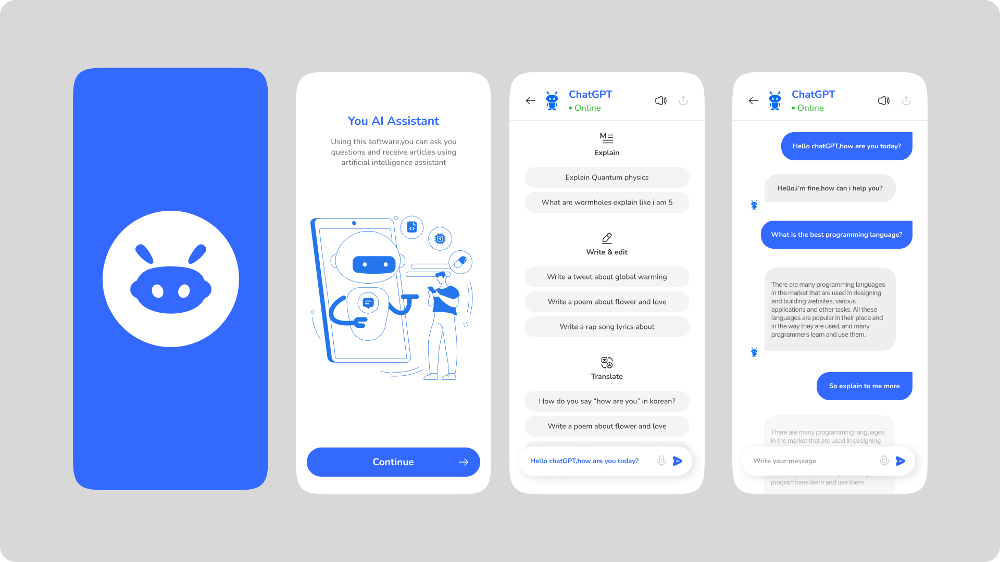

# ChatBot App 🤖

A Flutter-based chatbot application that integrates with an AI REST API to provide real-time conversational responses.

---

## 📌 Overview

ChatBot App is a cross-platform application built using Flutter.  
It enables users to send messages and receive AI-generated responses through API communication.

This project demonstrates:

- Clean and structured Flutter architecture  
- REST API integration  
- Dynamic chat message rendering  
- Responsive UI design  

---

## 🛠️ Technologies Used

- Flutter  
- Dart  
- HTTP (for API requests)  
- REST API  
- Material Design  

---

## 📱 Application Screens

---

## ⚙️ Getting Started

### 1. Clone the repository

git clone https://github.com/AmmarEmad-2004/ChatBot_App.git

### 2. Navigate to the project directory

cd ChatBot_App

### 3. Install dependencies

flutter pub get

### 4. Run the application

flutter run

To run on Chrome:

flutter run -d chrome

---

## 🔐 API Configuration

- Add your API key securely inside the API service file.
- Do not expose sensitive keys in public repositories.

---

## 🚀 Features

- Send and receive chatbot messages  
- AI-powered responses via REST API  
- Clean and modern chat UI  
- Cross-platform support (Android / iOS / Web)  

---

## 👤 Author

**Ammar Emad**  
GitHub: https://github.com/AmmarEmad-2004
